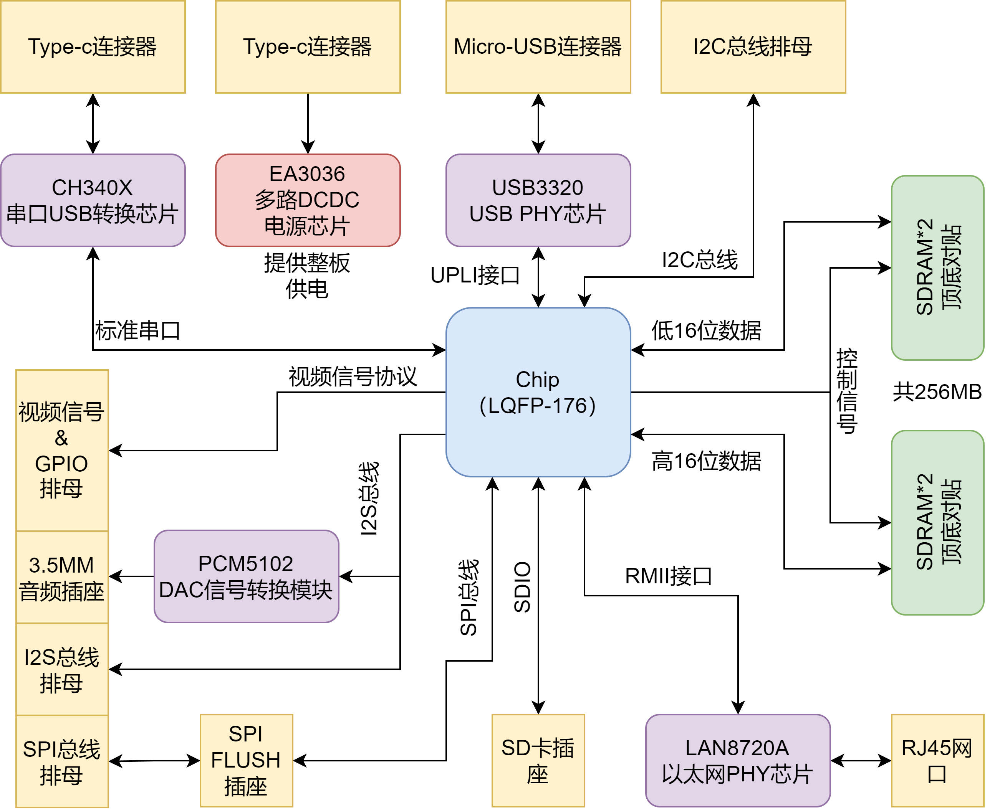
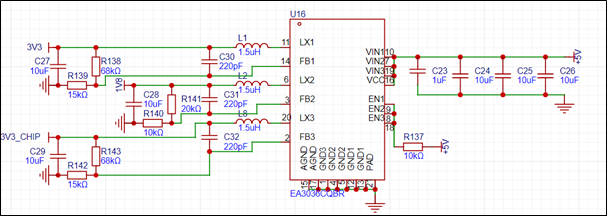
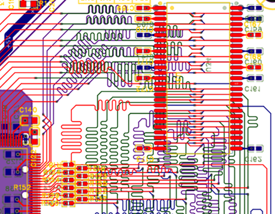
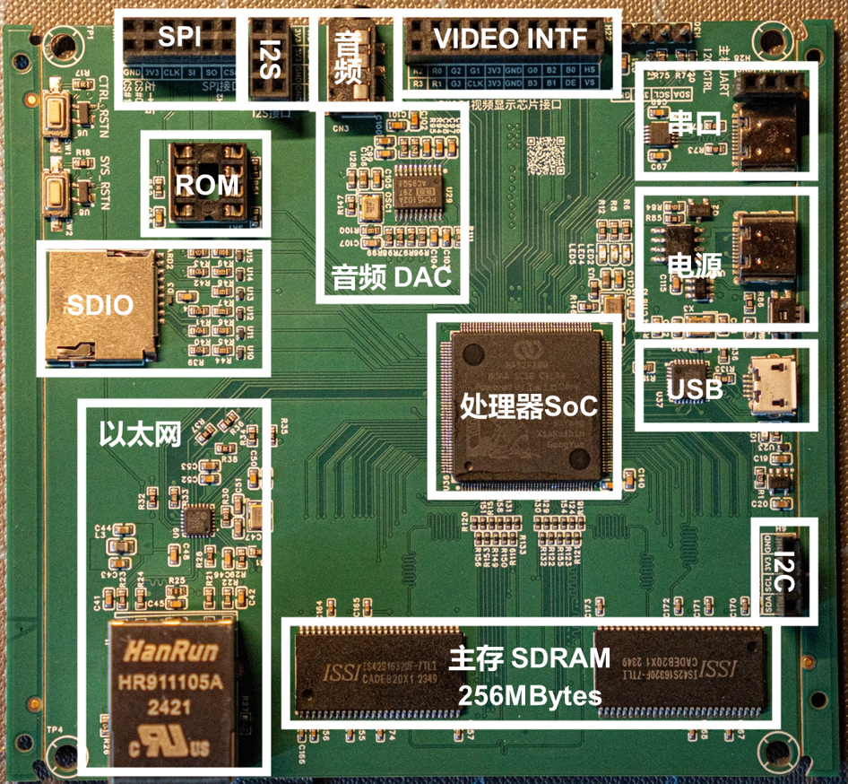

# LainBoard
我们为芯片回片后的测试设计了专用的PCB平台，集成电源芯片、SDRAM内存、FLASH以及USB PHY等芯片运行所需的硬件资源。该PCB使用国产LCEDA软件设计，共6个板层，其中第1、3、4、6为信号层，第2层为地层，第5层位电源层。PCB搭载的硬件资源如图所示。 

考虑到芯片及整板功耗较低，本设计供电方案选用Everanalog公司生产的EA3036电源芯片。EA3036是一款三路电源管理芯片，应用于直流5V供电或单节锂电池供电，内置三路同步电源调整模块，提供轻载高效模式，内置补偿电路，方便易用。电源电路原理图如图所示。其中3V3电源为板上外设提供供电，1V8电源主要为芯片内部电路提供供电，3V3_CHIP电源专为芯片IO和内存芯片提供供电。

内存芯片对于时序要求较高，设计过程中需要对走线长度进行控制，否则会影响信号完整性，产生数据错误。本文采用顶底对贴布局（在PCB顶层和底层重叠放置SDRAM芯片）并使用蛇形走线控制线长，所有SDRAM芯片的信号线线长度差值控制在5mm以内。图展示了本文其中两颗SDRAM芯片附近的走线情况。

最终的测试板实物如图：

我们推荐使用[立创EDA](https://pro.lceda.cn/)设计PCB，该软件操作简单文档详实，同时与立创的整套服打通，方便元件的采购、PCB制作与SMT贴片。
